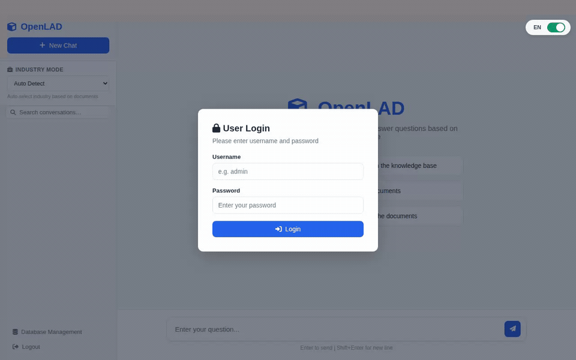

<p align="center">
  <h1>OpenLAD</h1>
  <em>Local Document AI Knowledge Base — Fully Offline, Fully Open</em>
</p>

<p align="center">
  <a href="LICENSE"></a>
  <a href="README_zh-CN.md"></a>
</p>

---

**OpenLAD** is an offline-first, local document intelligent Q&A system. Upload
your PDFs, Word documents, spreadsheets, and presentations — then ask questions
in natural language. Everything runs on your own hardware. No cloud. No
external API keys. No data leaves your premises.

Built for organizations that need a private document knowledge base on modest
hardware: a 16 GB consumer GPU and 32 GB of RAM is the recommended baseline.



<table>
<tr><td><b>🔒 Fully Offline</b></td><td>All processing — LLM inference, embeddings, OCR, document parsing — happens locally. Works on air-gapped networks.</td></tr>
<tr><td><b>📄 Multi-Format Ingestion</b></td><td>PDF, Word, Excel, PowerPoint, images, Markdown, HTML, TXT. Scanned/image-only pages are transcribed via a dedicated OCR endpoint (any OpenAI-compatible vision model, e.g. OvisOCR2), with Tesseract as an optional offline fallback.</td></tr>
<tr><td><b>🧠 Hybrid Retrieval</b></td><td>Full-text search (FTS5) + vector search (sqlite-vec) + LLM-driven planning. Three-phase pipeline: Plan → Retrieve → Synthesize.</td></tr>
<tr><td><b>🏭 Industry Plugins</b></td><td>Extensible plugin system. 1 complete sample pack (Semiconductor) + 3 empty templates (Legal, Financial, Generic) for customization. Custom packs can be built for any domain.</td></tr>
<tr><td><b>👥 Multi-Tenant</b></td><td>Isolated databases and vector spaces per tenant. Admin panel for user and document management.</td></tr>
<tr><td><b>🔐 Security</b></td><td>Login rate limiting (per-username + per-IP, no account lockout), expiring API keys (default 90 days, rotatable via admin panel), per-tenant data isolation, globally unique usernames.</td></tr>
<tr><td><b>🌐 Web UI</b></td><td>Built-in web interface. Admin panel at <code>/admin</code>, user Q&A at <code>/</code>. LAN-accessible.</td></tr>
<tr><td><b>🧩 BYO-LLM Architecture</b></td><td>Choose your own LLM and embedding backends — llama.cpp, Ollama, vLLM, or any OpenAI-compatible API.</td></tr>
</table>

---

## Quick Start

### Prerequisites

- **Ubuntu 22.04/24.04** (x86_64), macOS, or **Windows 10/11**
- **Python 3.10+**
- **16+ GB VRAM GPU** (NVIDIA recommended) and **32+ GB RAM** —
  smaller setups work with trade-offs: see the
  [hardware lookup table](docs/deployment.md#quick-configuration-lookup)

### 1. Clone & Install

```bash
git clone https://github.com/secmes755/openlad.git
cd openlad

python3 -m venv .venv
source .venv/bin/activate
pip install -r requirements.txt
```

### 2. Configure

```bash
cp .env.example .env
# edit .env: set OPENLAD_ADMIN_PASSWORD (required on first startup),
# and the model names/URLs if they differ from the defaults
```

`start.sh` sources `.env` automatically on launch; anything left unset falls
back to a built-in default. Full variable reference:
[configuration](docs/configuration.md).

### 3. Start Model Services

OpenLAD needs two model backends: an LLM and an embedding model. Use
**llama.cpp** (recommended) or [Ollama / any OpenAI-compatible
endpoint](docs/deployment.md#model-backends).

**Install llama.cpp and download the models:**

```bash
git clone https://github.com/ggerganov/llama.cpp.git /tmp/llama.cpp
cd /tmp/llama.cpp && cmake -B build && cmake --build build -j$(nproc)
sudo cp build/bin/llama-server /usr/local/bin/

mkdir -p ~/models
# LLM: Qwen3.5-9B Q5_K_M (~5.4 GB)
huggingface-cli download Qwen/Qwen3.5-9B-GGUF qwen3.5-9b-q5_k_m.gguf \
    --local-dir ~/models
# Embedding: Qwen3-Embedding-0.6B Q8_0 (~0.6 GB)
huggingface-cli download Qwen/Qwen3-Embedding-0.6B-GGUF \
    qwen3-embedding-0.6b-q8_0.gguf --local-dir ~/models
```

**Start the services** (one terminal each):

```bash
# LLM (port 8080)
llama-server \
    --model ~/models/qwen3.5-9b-q5_k_m.gguf \
    --host 127.0.0.1 --port 8080 --alias qwen3.5-9b \
    --n-gpu-layers 999 --ctx-size 262144 --parallel 2 \
    --batch-size 2048 --reasoning off \
    --cache-type-k q4_0 --cache-type-v q4_0 -n -1

# Embedding (port 8081)
llama-server \
    --model ~/models/qwen3-embedding-0.6b-q8_0.gguf \
    --host 127.0.0.1 --port 8081 --alias qwen3-embedding-0.6b \
    --n-gpu-layers 999 --ctx-size 8192 \
    --embeddings --pooling mean --batch-size 2048
```

> `--reasoning off` is **critical** for Qwen3.5 — thinking mode breaks
> structured outputs. Flag meanings and tuning per GPU size:
> [deployment guide](docs/deployment.md#recommended-llama-server-flags).

### 4. Start OpenLAD

```bash
./start.sh
```

Verify:

```bash
curl http://127.0.0.1:11296/api/v1/health
# → {"status":"ok",...} — status is "degraded" if a model endpoint is unreachable
```

Open your browser: **`http://localhost:11296/`** — log in as `admin` with the
password from `OPENLAD_ADMIN_PASSWORD`, upload a PDF, and ask a question.
Prefer the API? See the [curl quickstart](docs/api-quickstart.md).

### Windows

All Python dependencies ship Windows wheels (`pip install -r requirements.txt`
just works), and `sqlite-vec` loads through the standard extension API:

```powershell
git clone https://github.com/secmes755/openlad.git
cd openlad
python -m venv .venv
.\.venv\Scripts\Activate.ps1
pip install -r requirements.txt
$env:OPENLAD_ADMIN_PASSWORD = "<your-password>"   # required on first startup
.\start.ps1          # stop with .\stop.ps1
```

llama.cpp publishes prebuilt CUDA binaries (`llama-server.exe`) and Ollama has
a native Windows build — point `OPENLAD_LLM_URL` / `OPENLAD_EMB_URL` at them.
Two optional native components degrade gracefully when absent:
[poppler](https://github.com/oschwartz10612/poppler-windows/releases) (PDF page
rendering / chart analysis) and Tesseract (offline OCR fallback).
Text-extractable PDFs need neither. Data persists in `.\data` (gitignored).

### Docker

A single CPU-only container for the API; model services stay **outside** (on
the host via `network_mode: host`, or any reachable OpenAI-compatible
endpoint):

```bash
cp docker/.env.example .env   # set admin password + model URLs/names
docker compose up -d --build
# → http://<host>:11296
```

Data persists in `./data` (volume `./data:/app/data`); rebuilds keep your
documents. Details: [deployment guide](docs/deployment.md#docker).

---

## Documentation

| Guide | What it covers |
|---|---|
| [Deployment & hardware](docs/deployment.md) ([中文](docs/zh-CN/deployment.md)) | Hardware lookup table, model backends (llama.cpp / Ollama / OCR endpoint), recommended llama-server flags, Docker details |
| [Configuration reference](docs/configuration.md) ([中文](docs/zh-CN/configuration.md)) | Every `OPENLAD_*` environment variable, the embedding batch-size pairing rule, concurrency policy |
| [API quickstart](docs/api-quickstart.md) ([中文](docs/zh-CN/api-quickstart.md)) | Login → upload → query with curl; multi-document comparison |
| [Architecture](docs/architecture.md) ([中文](docs/zh-CN/architecture.md)) | System diagram, retrieval pipeline, industry-pack layering |
| [Troubleshooting](docs/troubleshooting.md) ([中文](docs/zh-CN/troubleshooting.md)) | Common setup failures and field-observed operational issues |

---

## License

OpenLAD is licensed under the **MIT License**.

All core dependencies use permissive licenses compatible with MIT — no AGPL,
no GPL, no copyleft restrictions:

| Dependency                 | License          | Role                         |
| -------------------------- | ---------------- | ---------------------------- |
| pypdf                      | BSD-3-Clause     | PDF text/metadata extraction |
| pdfplumber                 | MIT              | PDF table extraction         |
| pdf2image                  | MIT              | PDF page rendering           |
| FastAPI, Pydantic, uvicorn | MIT/BSD          | Web framework                |
| NumPy, Pandas, OpenCV      | BSD/Apache 2.0   | Data & image processing      |
| sqlite-vec                 | MIT / Apache 2.0 | Vector database              |

See [LICENSE](LICENSE) for the full text.

---

<p align="center">
  Built for organizations that value data sovereignty.
</p>
