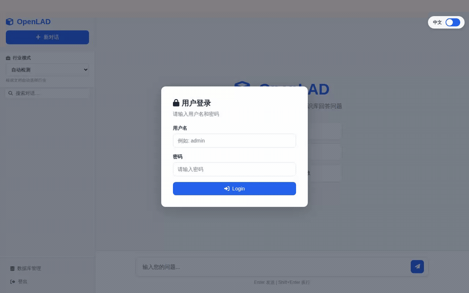

<p align="center">
  <h1>OpenLAD</h1>
  <em>本地文档 AI 知识库 — 完全离线，完全开放</em>
</p>

<p align="center">
  <a href="LICENSE"></a>
  <a href="README.md"></a>
</p>

---

**OpenLAD** 是一个离线优先的本地文档智能问答系统。上传你的 PDF、Word 文档、
表格和演示文稿，然后用自然语言提问。一切都在你自己的硬件上运行。无需云端。
无需外部 API 密钥。数据不出你的内网。

专为需要在普通硬件上搭建私有文档知识库的组织设计：推荐 16 GB 消费级 GPU
和 32 GB 内存作为基线配置。



<table>
<tr><td><b>🔒 完全离线</b></td><td>所有处理 — LLM 推理、Embedding、OCR、文档解析 — 均在本地完成。支持物理隔离网络。</td></tr>
<tr><td><b>📄 多格式入库</b></td><td>PDF、Word、Excel、PowerPoint、图片、Markdown、HTML、TXT。扫描件/纯图像页面经专用 OCR 端点转写（任意 OpenAI 兼容视觉模型，如 OvisOCR2），可选 Tesseract 离线兜底。</td></tr>
<tr><td><b>🧠 混合检索</b></td><td>全文检索（FTS5）+ 向量检索（sqlite-vec）+ LLM 驱动规划。三阶段流水线：规划 → 检索 → 合成。</td></tr>
<tr><td><b>🏭 行业插件</b></td><td>可扩展的插件系统。1 个完整示例包（半导体）+ 3 个空模板（法律、金融、通用）供定制。可为任意领域定制行业包。</td></tr>
<tr><td><b>👥 多租户</b></td><td>每租户独立数据库和向量空间。管理面板支持用户和文档管理。</td></tr>
<tr><td><b>🔐 安全</b></td><td>登录限流（按用户名 + 按 IP，不锁定账号）、API 密钥过期（默认 90 天，管理面板可轮换）、每租户数据隔离、用户名全局唯一。</td></tr>
<tr><td><b>🌐 Web 界面</b></td><td>内置 Web 界面。管理面板 <code>/admin</code>，用户问答 <code>/</code>。局域网可访问。</td></tr>
<tr><td><b>🧩 BYO-LLM 架构</b></td><td>自由选择 LLM 和 Embedding 后端 — llama.cpp、Ollama、vLLM，或任何 OpenAI 兼容 API。</td></tr>
</table>

---

## 快速开始

### 前置要求

- **Ubuntu 22.04/24.04**（x86_64）、macOS，或 **Windows 10/11**
- **Python 3.10+**
- **16+ GB VRAM GPU**（推荐 NVIDIA）和 **32+ GB 内存** —
  更小的配置也可运行但有取舍：见[硬件配置查表](docs/zh-CN/deployment.md#快速配置查表)

### 1. 克隆与安装

```bash
git clone https://github.com/secmes755/openlad.git
cd openlad

python3 -m venv .venv
source .venv/bin/activate
pip install -r requirements.txt
```

### 2. 配置

```bash
cp .env.example .env
# 编辑 .env：设置 OPENLAD_ADMIN_PASSWORD（首次启动必填），
# 以及与你环境不一致的模型名称/地址
```

`start.sh` 启动时会自动加载 `.env`；未设置的变量回落到内置默认值。
全部变量说明见[配置参考](docs/zh-CN/configuration.md)。

### 3. 启动模型服务

OpenLAD 需要两个模型后端：一个 LLM 和一个 Embedding 模型。使用
**llama.cpp**（推荐）或 [Ollama / 任意 OpenAI 兼容端点](docs/zh-CN/deployment.md#模型后端)。

**安装 llama.cpp 并下载模型：**

```bash
git clone https://github.com/ggerganov/llama.cpp.git /tmp/llama.cpp
cd /tmp/llama.cpp && cmake -B build && cmake --build build -j$(nproc)
sudo cp build/bin/llama-server /usr/local/bin/

mkdir -p ~/models
# LLM：Qwen3.5-9B Q5_K_M（约 5.4 GB）
huggingface-cli download Qwen/Qwen3.5-9B-GGUF qwen3.5-9b-q5_k_m.gguf \
    --local-dir ~/models
# Embedding：Qwen3-Embedding-0.6B Q8_0（约 0.6 GB）
huggingface-cli download Qwen/Qwen3-Embedding-0.6B-GGUF \
    qwen3-embedding-0.6b-q8_0.gguf --local-dir ~/models
```

**启动服务**（各用一个终端）：

```bash
# LLM（端口 8080）
llama-server \
    --model ~/models/qwen3.5-9b-q5_k_m.gguf \
    --host 127.0.0.1 --port 8080 --alias qwen3.5-9b \
    --n-gpu-layers 999 --ctx-size 262144 --parallel 2 \
    --batch-size 2048 --reasoning off \
    --cache-type-k q4_0 --cache-type-v q4_0 -n -1

# Embedding（端口 8081）
llama-server \
    --model ~/models/qwen3-embedding-0.6b-q8_0.gguf \
    --host 127.0.0.1 --port 8081 --alias qwen3-embedding-0.6b \
    --n-gpu-layers 999 --ctx-size 8192 \
    --embeddings --pooling mean --batch-size 2048
```

> `--reasoning off` **至关重要** —— Qwen3.5 的思考模式会破坏结构化输出。
> 各参数含义与不同显存下的调法见[部署指南](docs/zh-CN/deployment.md#推荐-llama-server-参数)。

### 4. 启动 OpenLAD

```bash
./start.sh
```

验证：

```bash
curl http://127.0.0.1:11296/api/v1/health
# → {"status":"ok",...} — 模型端点不可达时 status 为 "degraded"
```

打开浏览器：**`http://localhost:11296/`** —— 用 `OPENLAD_ADMIN_PASSWORD`
设置的密码以 `admin` 登录，上传一份 PDF，然后提问。
想用 API？见 [curl 快速上手](docs/zh-CN/api-quickstart.md)。

### Windows

所有 Python 依赖均提供 Windows wheel（`pip install -r requirements.txt`
直接可用），`sqlite-vec` 通过标准扩展 API 加载，已在 Windows 上验证：

```powershell
git clone https://github.com/secmes755/openlad.git
cd openlad
python -m venv .venv
.\.venv\Scripts\Activate.ps1
pip install -r requirements.txt
$env:OPENLAD_ADMIN_PASSWORD = "<你的密码>"   # 首次启动必填
.\start.ps1          # 停止用 .\stop.ps1
```

llama.cpp 提供预编译 CUDA 二进制（`llama-server.exe`），Ollama 也有原生
Windows 版本 —— 用 `OPENLAD_LLM_URL` / `OPENLAD_EMB_URL` 指向它们即可。
两个可选原生组件缺失时会优雅降级：
[poppler](https://github.com/oschwartz10612/poppler-windows/releases)
（PDF 页面渲染 / 图表分析）和 Tesseract（离线 OCR 兜底）。本身可提取文本的
PDF 两者都不需要。数据持久化在 `.\data`（已 gitignore）。

### Docker

API 单容器运行，容器纯 CPU 是刻意设计 —— 模型服务保持在**容器外**
（通过 `network_mode: host` 使用宿主机上的模型服务，或直连任意可达的
OpenAI 兼容端点）：

```bash
cp docker/.env.example .env   # 设置管理员密码 + 模型地址/名称
docker compose up -d --build
# → http://<主机>:11296
```

数据持久化在 `./data`（卷 `./data:/app/data`），重建容器不丢文档。
详见[部署指南](docs/zh-CN/deployment.md#docker)。

---

## 文档

| 指南 | 内容 |
|---|---|
| [部署与硬件](docs/zh-CN/deployment.md)（[English](docs/deployment.md)） | 硬件配置查表、模型后端（llama.cpp / Ollama / OCR 端点）、推荐 llama-server 参数、Docker 细节 |
| [配置参考](docs/zh-CN/configuration.md)（[English](docs/configuration.md)） | 全部 `OPENLAD_*` 环境变量、Embedding batch-size 配对规则、并发策略 |
| [API 快速上手](docs/zh-CN/api-quickstart.md)（[English](docs/api-quickstart.md)） | 用 curl 完成 登录 → 上传 → 提问；多文档对比 |
| [架构](docs/zh-CN/architecture.md)（[English](docs/architecture.md)） | 系统结构图、检索流水线、行业包分层 |
| [故障排除](docs/zh-CN/troubleshooting.md)（[English](docs/troubleshooting.md)） | 常见安装失败与实测运维问题 |

---

## 许可证

OpenLAD 基于 **MIT 许可证** 开源。

所有核心依赖均使用与 MIT 兼容的宽松许可证 —— 无 AGPL、无 GPL、
无 copyleft 限制：

| 依赖                         | 许可证              | 作用           |
| -------------------------- | ---------------- | ------------ |
| pypdf                      | BSD-3-Clause     | PDF 文本/元数据提取 |
| pdfplumber                 | MIT              | PDF 表格提取     |
| pdf2image                  | MIT              | PDF 页面渲染     |
| FastAPI, Pydantic, uvicorn | MIT/BSD          | Web 框架       |
| NumPy, Pandas, OpenCV      | BSD/Apache 2.0   | 数据与图像处理      |
| sqlite-vec                 | MIT / Apache 2.0 | 向量数据库        |

详见 [LICENSE](LICENSE) 全文。

---

<p align="center">
  为重视数据主权的组织而建。
</p>
